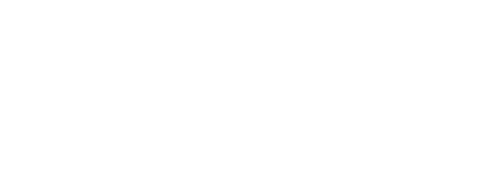
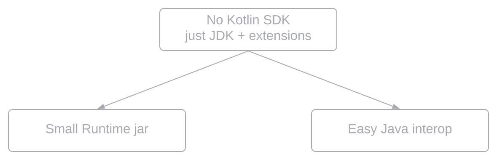
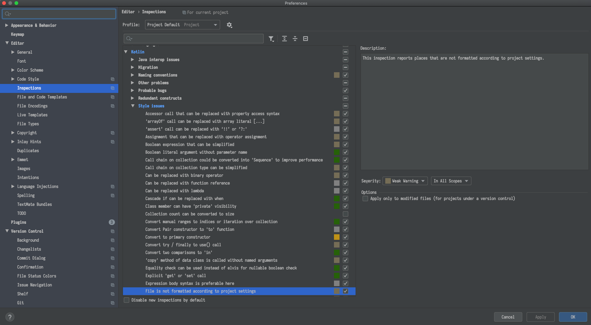
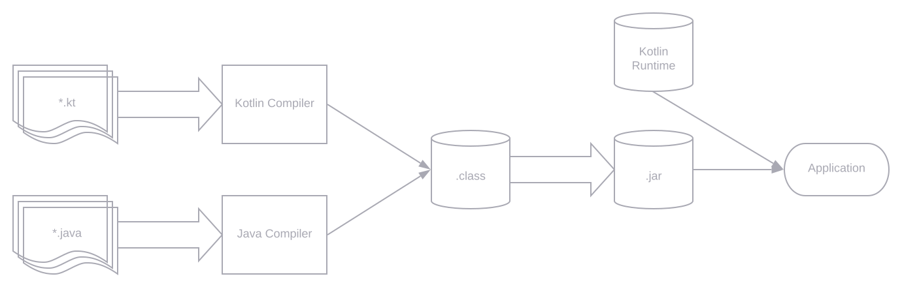
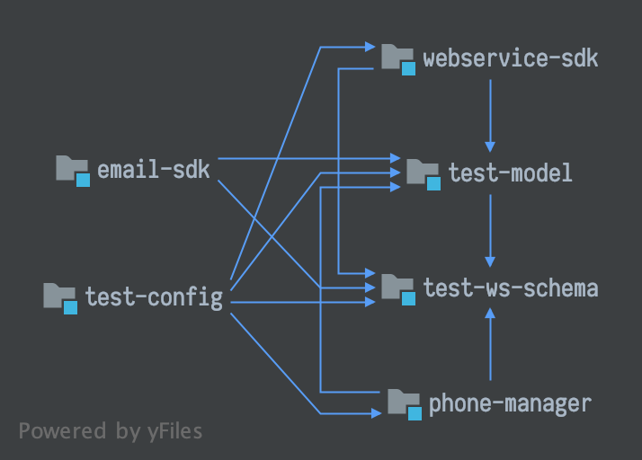
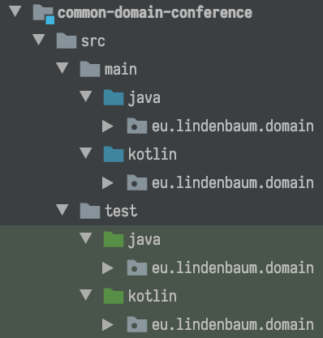
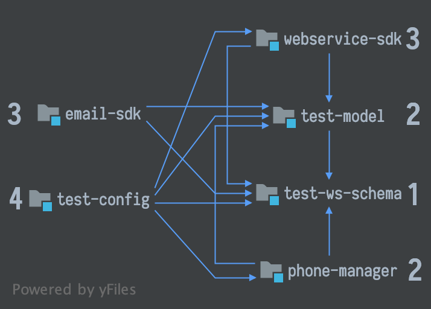
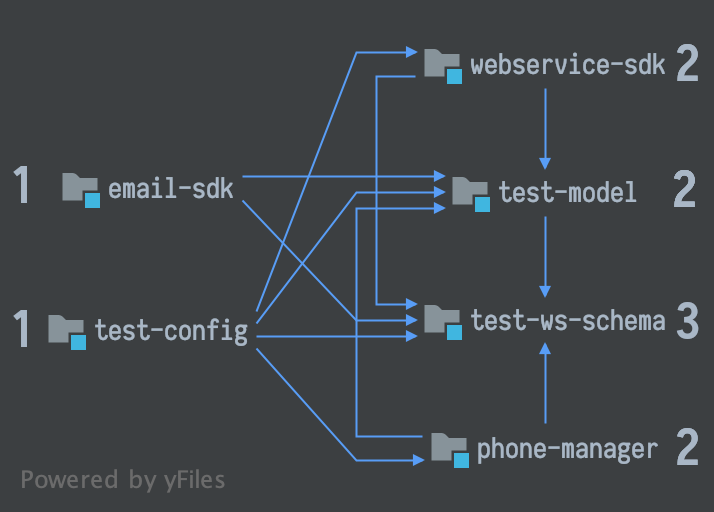
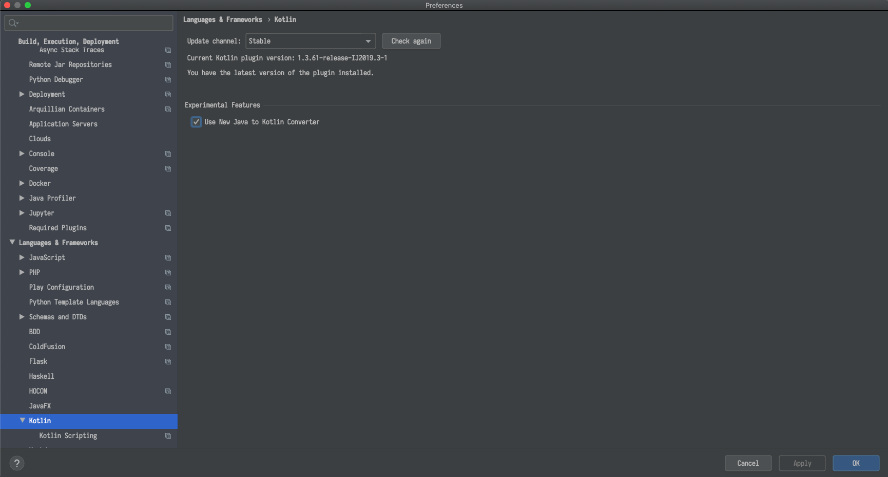

## Intro
I came to the world of programming through Java path. And during my entire career I was programming 
mostly in Java. When Kotlin became more and more popular in programming world I wanted to answer 
the question is it worth to use Kotlin in Java project or not?
And it turned out, as always in engineering, that answer is it depends.
This post is the way of a company I was working for and our experience.
So let's have a journey from island of Java to island of Kotlin together.

## How was my first time?
{{< style "img { float: right; margin: 0.5em; width: 22%; }" >}}

My first acquaintance with Kotlin was when it has such a weird logo.

Back then I wrote nothing more than "Hello, World!" project in Kotlin and only followed Kotlin
community to be informed about new features and changes. But ~7 years ago I tried first time
Kotlin in enterprise project for test automation API. Project was small and went for a while.

Only in 2017 after some iterations of rejection and acceptance among other engineers we introduced
Kotlin full time in our Java components in production running project. This was not a huge project:
500K LOC, but was quite a while in production: for 12 years.


## Main kotlin features
Kotlin is elegant, pragmatic and tool friendly language, but elegance is great, as long as
it's pragmatic. It is not a research project, but the language which was build for engineers
by engineers.
{{< style "td,th,thead,table { border: none;  background-color: transparent; text-align: center; } img {  width: 65%; }"  >}}
|  |  |  |  |
| --- | --- | -- | --- |
| **CONCISE** | **SAFE** | **INTEROPERABLE** | **TOOL-FRIENDLY** |
| *Drastically reduce the amount of boilerplate code* | *Avoid entire classes of errors such as null pointer exceptions* | *Leverage existing libraries for the JVM, Android and the Browser* | *Choose any Java IDE or build from the command line* |


## Kotlin ecosystem
One of the magic of Java - is its backwards compatibility, but it's also a big bottleneck,
which limits some features and makes some features implemented in the inefficient way.
Kotlin was designed with keeping in mind all drawbacks of Java, but being 100% interoperable with it.
{{< style "img { display:block; margin: auto; }" >}}




## What ∆ do we expect?
Why we decided to introduce kotlin?

In our project we had:
- A lot of Java code which was written starting from Java 1.4
- Lot of entities which are changing
- Fit enough with boilerplate code and kludges

We would like to get:
- Better code reading
- Faster feature creation
- Less routing coding
- More expressive

What does Kotlin give us:
- Code is shorter
- Null-safety
- Automatic type inference
- Great interoperability with Java
- Extension methods
- Ideal delegation

This is really all that pluses which Kotlin provides. This is what we were trying to achieve
during the migration and this is what basically we got.

## Disadvantages?
Everything looks so sweet by far. But is there a dark side?

Actually yes and I should say about it. If you like ternary operator, you should forget about it.
And there some things you should be ready for: you will be not able to assign int to long variable,
nothing will be cast automatically. You would lose some Intellij features. And you would have
some bugs. Together with less code and better readability you will also get some noise.
But still we have more advantages.

## Code style
Important preparation step to the migration is Code Style. A new code style adoption might be a very
natural process, if it starts with a new project, when there's no code formatted in the old way.
Changing formatting in an existing project is a far more demanding task, and should probably
be started with discussing all the caveats with the team.
{{< style "img { display:block; margin: auto; }" >}}



### Coding conventions
There is for quite a long time like from 2018 so-called coding Kotlin conventions, but if you
started before it or before Kotlin version 1.3, then you do not have all it in your project.
But fortunately you have a special flag you can enable in maven or gradle which helps to
synchronise your team.
{{< style "img { display:block; margin: auto; }" >}}



<properties>
<kotlin.code.style>official</kotlin.code.style>
</properties>



kotlin.code.style=official


### Check style
[KTLINT](https://github.com/pinterest/ktlint)

[DETEKT](https://github.com/detekt/detekt)

Who fails the build if the check fails?

## Mixing Kotlin and JAVA
As Kotlin compiles to Java byte code you can have both Java and Kotlin code in one project, and you
can gradually add Kotlin to your existing project. Although blending Java and Kotlin works great, you
can't write idiomatic Java nor Kotlin code, when blending. So the goal should be to move completely to
Kotlin.
{{< style "img { display:block; margin: auto; }" >}}



## Strategies for adoption
We can live with both languages in production more or less good, but this leads us to other question how to adopt Kotlin
on practice? On the right picture you can see module with 2 source folders Java and Kotlin respectively usually
```kotlinc``` invoked first to compile Kotlin files, then javac to compile Java on demand if there are dependency from
Kotlin to JAVA.
{{< style "td,th,thead,table { border: none;  background-color: transparent; text-align: left; } img { margin: 0.5em; } "  >}}
|  |  |
| --- | --- |

- Use Module Dependency Graph as a map
- Build tools: first invoke ```kotlinc```, then ```javac```
- Kotlin compiler knows when to invoke ```javac```

## Conversion strategies
The next question is how to convert your code systematically:
- One more systematic way is to go random and wild, and do it along the task it hands. From the technical point of view
  this is the worst approach, but it is the best following the business value.

Here you can see to incremental systematic approaches:
- Inside-out, you take your dependency graph and first convert your innermost modules going outside.
  {{< style "img { display:block; margin: auto; }" >}}
  
  
- And outside-in you start from outside your graph and then go to the
  innermost:
  {{< style "img { display:block; margin: auto; }" >}}
  
  

## JAVA to Kotlin converter
Magic keys combination CMD + Option + Shift + K. Works only in one direction. Your Java class will become Kotlin class,
but most of the case you require some revision and rework. What is the difference of new Kotlin converting. JetBrains
advertise improved nullability conversion.
{{< style "img { display:block; margin: auto; }" >}}


Converter is software. It can have bugs. Be aware.
> ⚠️ **No tests, no conversion!**

### Converting: from JAVA
You can automatically convert JAVA code to Kotlin code. But does the automatic JAVA to Kotlin converter always produces
the idiomatic Kotlin code? Actually not. Kotlin converter does not produce the best results:

public class Participant {

    private AudioState audioState;
 
    public AudioState getAudioState() {
        return audioState;
    }

}


public class Conference {
private List<Participant> participants;
private ConferenceState state;

    public List<Participant> getParticipants() {
    return participants;
    }
    
    public ConferenceState getState() {
    return state;
    }
}


public class Example {

    public void test() {
        Conference conference = new Conference();
 
        String conferenceState = conference.getState().name();
 
        if (conferenceState.equals(ConferenceState.ENDED.name())) {
            conference.getParticipants().forEach(p -> {
                if (!p.getAudioState().name().equals(AudioState.CONNECTED.name())) {
                    p.disconnect();
                }
            });
        }
    }
}


class Example {
  fun test() {
    val conference = Conference()
    val conferenceState = conference.state.name
    if (conferenceState == ConferenceState.ENDED.name) {
      conference.participants.forEach(Consumer { p: Participant ->
        if (p.audioState.name != AudioState.CONNECTED.name) {
          p.disconnect()
        }
      })
    }
  }
}


### Converting: to Kotlin
But if you've written your Java code so that it can be easily interpreted, the converted Kotlin code becomes better.
Refactor your Java code -> convert to Kotlin using automatic converter, then simplify. We know the strategy, we have
the tool, but where to start? First we proofed that our project works with Kotlin and our team understands how to mix
it. We started to refactor some old Java code to Kotlin, mainly tests, which typically means calling from Java code into
Kotlin. Then we started converting small classes such interfaces, enums and small data classes written in Java into
Kotlin. After that all the new features we wrote with Kotlin. You do not have to alter all surrounding Java code due to
Java and Kotlin interop smoothly. Java does not know about any Kotlin running at all.

public class Participant {

    private AudioState audioState;
    @Nullable
    public AudioState getAudioState() {
        return audioState;
    }
}


public class Conference {
  private List<Participant> participants;
  private ConferenceState state;
  @Nullable
  public List<Participant> getParticipants() {
    return participants;
  }
  @Nullable
  public ConferenceState getState() {
    return state;
  }
}


public class Example {
    public void test() {
        Conference conference = new Conference();
 
        String conferenceState = conference.getState().name();
 
        if (conferenceState.equals(ConferenceState.ENDED.name())) {
            conference.getParticipants().forEach(p -> {
                if (!p.getAudioState().name().equals(AudioState.CONNECTED.name())) {
                    p.disconnect();
                }
            });
        }
    }
}


class Example {
  fun test() {
    val conference = Conference()
    val conferenceState = conference.state!!.name
    if (conferenceState == ConferenceState.ENDED.name) {
      conference.participants!!.forEach(Consumer { p: Participant ->
        if (p.audioState!!.name != AudioState.CONNECTED.name) {
          p.disconnect()
        }
      })
    }
  }
}


## Testing in Kotlin
### Naming
Some Java frameworks like Spring are known with its class and methods names. Something like
AbstractPostProcessorFactoryBean and this is not the longest name, but Kotlin could do better.
You can write more readable names with spaces. However, dotes and carriage returns are not allowed.

@Test
fun `The very detailed and readable test name`() {
assertThat("String", instanceOf(String::class.java))
}


### Kotlin + JUnit
Probably the most popular Java framework for unit testing is JUnit. And it works out of the box with some assumptions.
You should know that ```@BeforeAll``` and ```@AfterAll``` should be defined in the companion object.
Companion is such small singleton inside our class.
And everything what is inside this singleton is static. There are no static fields in Kotlin.
In Parameterized tests ```ClassRule```, ```MethodRule``` and Parameter should be defined as ```@JvmFields```.
There should be no getters and setters generated for them, only Java field. We can use ```@JvmStatic``` so that our
```@BeforeAll``` and ```@AfterAll``` will be generated not inside companion, but inside test class.
```@BeforeAll``` and ```@AfterAll``` go to Companion Object
```@Rule``` and ```@Parameter``` should be appended with ```@JvmField```

companion object {
@JvmStatic @BeforeClass
fun setUp() {}

    @ClassRule @JvmField
    var resource: ExternalResource = object : ExternalResource() {
      override fun before() {
        conference.connect()
      }

      override fun after() {
        conference.disconnect()
      }
    }
}

@Rule @JvmField
var rule = TemporaryConference()


### Kotlin + Mockito
Second part of the testing is Mocks. This is very hard to test huge and complicated code with a lot of dependencies,
so we use mocks to avoid it.
And here using classic mockito we got some problems.

```anyObject()``` matcher returns ```null```.
This is a problem as Kotlin checks for null-safety. When Kotlin accesses the object it checks that object is not null.
And if it is null, then Kotlin returns Kotlin NPE.

```anyString()``` also returns ```null```, this is strange as they could return just empty string.
Probably, it is done to save memory.

```When``` is keyword in Kotlin and used in Mockito do define module behaviour. With ```when``` this is very easy
to solve the problem by importing it with the other name.

For ```anyObject```: if we do not want to use third party libraries we have to write a kludge.

We can create extension function which will pass the concrete class to the mockito ```any()```.
We use function of the reified generics, it compiles in your kotlin code and type will be known there.

import org.mockito.Mockito.`when` as on


inline fun &ltreified T> kotlinAny(): T = kotlinAny(T::class.java)
inline fun &ltreified T> kotlinAny(t: Class&ltT>): T = Mockito.any&ltT>(t)


### The Chad Mockito
But Mockito could be beautiful and idiomatic. MockK library allows us to solve all the problems in a one shot.

val car = mockk&ltCar>()

every { car.drive(Direction.NORTH) } returns Outcome.OK

car.drive(Direction.NORTH) // returns OK

verify { car.drive(Direction.NORTH) }

confirmVerified(car)


## Problem of the no-args constructors in Java
If you are using the Java Persistence API (JPA) you will have problems there.
You would probably want to use Data classes for your entities in Kotlin.
And this is logical desire, the have lot of perks, like equals and hashcode out of the box, Kotlin ```copy()``` functionality.

Data classes have no no-arg constructor, but you need it in JPA. This is must have requirement in JPA.
As solution - do not use data classes, but then you loose all perks.

Second: use the no-arg compiler plugin. It generates an additional zero-argument constructor for classes with a specific annotation.
The generated constructor is synthetic, so it can’t be directly called from Java or Kotlin, but it can be called using reflection.
This allows JPA to instantiate a class, although it doesn't have the zero-parameter constructor from Kotlin or Java point of view.

<configuration>
<compilerPlugins>
<!-- Or "jpa" for JPA support -->
<plugin>no-arg</plugin>
</compilerPlugins>

          <pluginOptions>
              <option>no-arg:annotation=com.my.Annotation</option>
            <!-- Call instance initializers in the synthetic constructor -->
            <!-- <option>no-arg:invokeInitializers=true</option> -->
          </pluginOptions>
</configuration>
<dependencies>
      <dependency>
          <groupId>org.jetbrains.kotlin</groupId>
          <artifactId>kotlin-maven-noarg</artifactId>
          <version>${kotlin.version}</version>
      </dependency>
</dependencies>


buildscript {
    dependencies {
        classpath "org.jetbrains.kotlin:kotlin-noarg:$kotlin_version"
    }
}

apply plugin: "kotlin-noarg"

noArg {
annotation("com.my.Annotation")
}


## Problem of the final classes in Kotlin
Kotlin has classes and their members final by default, which makes it inconvenient to use frameworks and libraries
such as Spring AOP that require classes to be open. The all-open compiler plugin adapts Kotlin to the requirements of
those frameworks and makes classes annotated with a specific annotation and their members open without the explicit open keyword.

<configuration>
<compilerPlugins>
<!-- Or "spring" for the Spring support -->
<plugin>all-open</plugin>
</compilerPlugins>

          <pluginOptions>
              <!-- Each annotation is placed on its own line -->
              <option>all-open:annotation=com.my.Annotation</option>
              <option>all-open:annotation=com.their.AnotherAnnotation</option>
          </pluginOptions>
</configuration>

<dependencies>
      <dependency>
          <groupId>org.jetbrains.kotlin</groupId>
          <artifactId>kotlin-maven-allopen</artifactId>
          <version>${kotlin.version}</version>
      </dependency>
</dependencies>


buildscript {
    dependencies {
        classpath "org.jetbrains.kotlin:kotlin-allopen:$kotlin_version"
    }
}

apply plugin: "kotlin-allopen"

allOpen {
annotation("com.my.Annotation")
// annotations("com.another.Annotation", "com.third.Annotation")
}


## Some Language Features

public interface ParticipantDetails {
String getName();
String getLastName();
}

What is the problem here?

There are no getters and setters in Kotlin. You can not write something like ```override get() =...```.
You should create private properties which obviously do not have generated getters and setters.

data class Participant(private val name: String,
private val lastName: String) : Conference.ParticipantDetails {
override fun getName(): String {
return name;
}

        override fun getLastName(): String {
            return lastName;
        }
    }


## Working with Annotations

data class Moderator(
@NotNull
val name: String,
@Active
val conference: Conference
) {}

What could go wrong here?

This is not clear that annotations applied to arguments of the constructor.
Hibernate-validator does not know anything about arguments of the constructor. - keyword "field" helps us.

```Notnull``` annotation will never be reached, as if you pass null first kotlin fill throw kotlin NPE,
you probably should define field as nullable. Hibernate does not know about annotated arguments of the constructor,
but jackson knows, you can use ```jackson-module-kotlin```, and you will have all kotlin features out of the box.


data class Moderator(
@field:NotNull
val name: String,
@field:Active
val conference: Conference
) {}


### Java + Lombok = Kotlin
We use lombok in our project. What are the equivalents in Kotlin? What we are not loosing?
Is there something that Kotlin does not provide us without of the box?
{{< style "td,th,thead,table { border: none;  background-color: transparent; text-align: center; } "  >}}
|     |     |
| --- | --- |
| **@Getters**|**Properties** |
**@Setters**|
| | |
| | |
| | |
| **@NonNull**| **Nullable Types** |
| | |
| | |
| | |
| **val/var**| **val/var** |


### Java + Lombok. Delomboking
We still can generate some of them like equals and hash code using Intellij.
And we should do additionally some steps before converting from Java to Kotlin.
There is tool provided by Intellij, called delombock.
{{< style "td,th,thead,table { border: none;  background-color: transparent; text-align: center; } "  >}}
|     |     |
| --- | --- |
| **@Equals**|**@HashCode** |
| | |
| | |
| | |
| **@ToString**| **Synchronized** |


## Caveats for Java Developers

class ConferenceCall {
val id: Int = Random.nextInt(0, 100)
}


fun getConference() {
val conferenceCall = ConferenceCall()
for (i in 1..10) {
println("Conference Call ID: ${conferenceCall.id}")
}
}


class ConferenceCall {
val id: Int
get() {
return Random.nextInt(0, 100)
}
}


fun getConference() {
val conferenceCall = ConferenceCall()
for (i in 1..10) {
println("Conference Call ID: ${conferenceCall.id}")
}
}

Learn tools you use very good. As experience Java developer could think Kotlin is just Java with syntax sugar,
sometimes they could be wrong. Kotlin is very flexible language and in some cases you can shoot yourself in the foot.
As the same simple getter written in 2 different ways will also behave differently.

## Human Factors: Rejection
Among the technical difficulties also there could be human factors. When debating whether to use Kotlin or Java for 
development you should be aware that there's a third option: use both. And you can explain it to the colleagues and 
do not force them to use Kotlin, but simply let them stay with Java. It is possible to have Kotlin and Java classes 
side by side within the same project and everything will still compile.

## Human Factors: Approaching
How would you convince people? 

First avoid Kotlin is cool argument, instead focus on the language features that promote maintainability and safety, 
also remind people that it can be adopted incrementally. And it is a gradual evolution instead of revolution.

## Overall Code Base

{
"title": {
"text": "Line of Codes",
"top": "2%",
"left": "center"
},
"tooltip": {
"trigger": "axis"
},
"grid": {
"left": "3%",
"right": "5%",
"bottom": "0%",
"top": "12%",
"containLabel": true
},
"toolbox": {
"feature": {
"saveAsImage": {
"title": "Save as Image"
}
}
},
"dataset": {
"source": [
["linesOfCode", "programmingLanguage"],
[812795, "Java"],
[93206, "JavaScript"],
[54233, "XML"],
[35160, "Haskell"],
[32720, "Maven"],
[27179, "ActionScript"],
[25494, "Kotlin"],
[23563, "Mustache"],
[21718, "HTML"],
[19377, "XSD"],
[17114, "CSS"],
[13353, "MXML"],
[10959, "Groovy"],
[8970, "Bourne Shell"],
[7721, "SVG"],
[7138, "LESS"],
[5984, "Markdown"],
[4177, "YAML"],
[1683, "Elm"],
[1247, "AsciiDoc"],
[910, "Bourne Again Shell"],
[904, "Perl"],
[868, "XSLT"],
[457, "JSON"],
[457, "Python"],
[ 278, "SQL"],
[196, "Erlang"],
[ 173, "Cucumber"],
[ 153, "INI"],
[110, "Gradle"],
[95, "Nix"],
[85, "DOS Batch"],
[66, "diff"],
[55, "Velocity Template Language"],
[10, "Scala"],
[5, "sed"]
]
},
"xAxis": {
"type": "log",
"show": false
},
"yAxis": {
"type": "category",
"inverse": true
},
"series": [
{
"type": "bar",
"encode": {
"x": "linesOfCode",
"y": "programmingLanguage"
},
"label": {
"show": true,
"position": "inside"
},
"itemStyle": {
"color": "#4679AA"
}
}
]
}


## Java + Kotlin

{
"title": {
"text": "Line of Codes",
"top": "1%",
"left": "center"
},
"tooltip": {
"trigger": "axis"
},
"legend": {
"data": ["Java LOC %", "Kotlin LOC %"],
"top": "6%"
},
"grid": {
"left": "3%",
"right": "5%",
"bottom": "3%",
"top": "12%",
"containLabel": true
},
"toolbox": {
"feature": {
"saveAsImage": {
"title": "Save as Image"
}
}
},
"dataset": {
"source": [
["javaLoc", "kotlinLoc", "component"],
[48, 52, "a1"],
[75, 25, "a8"],
[100, 0, "b1"],
[100, 0, "b2"],
[100, 0, "b5"],
[0, 100, "b6"],
[100, 0, "c0"],
[100, 0, "c1"],
[90, 10, "c2"],
[100, 0, "c3"],
[82, 18, "c4"],
[98, 2, "d1"],
[78, 22, "z2"],
[0, 100, "z9"]
]
},
"xAxis": {
},
"yAxis": {
"type": "category",
"inverse": true
},
"series": [
{
"name": "Java LOC %",
"type": "bar",
"stack": "one",
"encode": {
"x": "javaLoc",
"y": "component"
},
"emphasis": {
"focus": "series"
},
"itemStyle": {
"color": "#4679AA"
}
},
{
"name": "Kotlin LOC %",
"type": "bar",
"stack": "one",
"encode": {
"x": "kotlinLoc",
"y": "component"
},
"emphasis": {
"focus": "series"
},
"itemStyle": {
"color": "#EC522C"
}
}
]
}


## Kotlin Tooling in 2020
Kotlin is built with Tooling in mind from the ground up. It is well integrated with IntelliJ Idea and Android Studio. 
Yet, refactorings are not as rich as for Java, but steadily improving in JetBrains IDEs. However, not much for other 
IDEs available. Certain vendor Lock-In inevitable as of today. Kotlin has a very good support in Maven and Gradle.

Kotlin built by company which produces Intellij Idea IDE, which has first class support of the language. 
More and more new open source libraries appear on gitHub, which written in Kotlin and to be used in Kotlin environment.
Also, you can use existing Java libraries from Kotlin.

## Conclusion
 - There is no free lunch, but Kotlin tastes good
 - Especially suitable for users of JetBrains IDEs
 - Very good interop with Java and small footprint
 - It is a good trade-off with significant advantages
 - More safety, more solid design, less boilerplate
 - Applicable for new and legacy codebase

Finally, Kotlin is an excellent piece of engineering. It's a good trade of for less boilerplate,
better design and most importantly it could be used in legacy code bases just a long side with Java.
