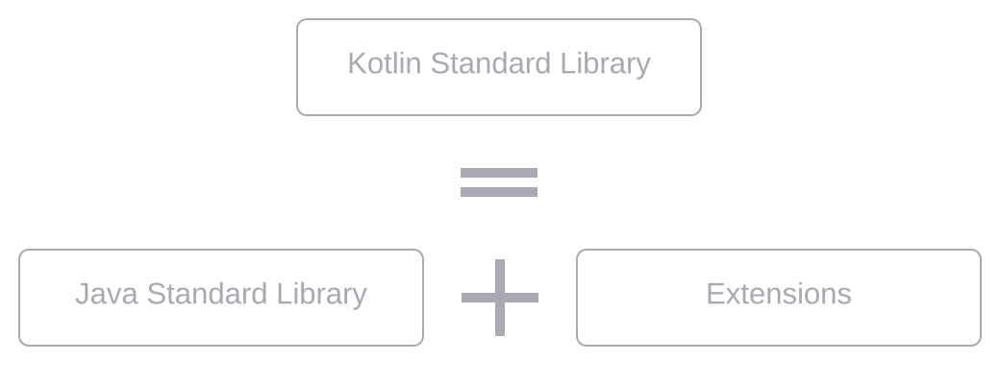

### Intro
I came to the world of programming through Java path. And during my entire career I was programming 
mostly in Java. When Kotlin became more and more popular in programming world I wanted to answer 
the question is it worth to use Kotlin in Java project or not?
And it turned out, as always in engineering, that answer is it depends.
This post is the way of a company I was working for and our experience.
So let's have a journey from island of Java to island of Kotlin together.

### How was my first time?
{{< style "img { float: right; margin: 0.5em; width: 22%; }" >}}

My first acquaintance with Kotlin was when it has such a weird logo.

Back then I wrote nothing more than "Hello, World!" project in Kotlin and only followed Kotlin
community to be informed about new features and changes. But ~7 years ago I tried first time
Kotlin in enterprise project for test automation API. Project was small and went for a while.

Only in 2017 after some iterations of rejection and acceptance among other engineers we introduced
Kotlin full time in our Java components in production running project. This was not a huge project:
500K LOC, but was quite a while in production: for 12 years.


### Main kotlin features
Kotlin is elegant, pragmatic and tool friendly language, but elegance is great, as long as
it's pragmatic. It is not a research project, but the language which was build for engineers
by engineers.
{{< style "td,th,thead,table { border: none;  background-color: transparent; text-align: center; } img {  width: 65%; }"  >}}
|  |  |  |  |
| --- | --- | -- | --- |
| **CONCISE** | **SAFE** | **INTEROPERABLE** | **TOOL-FRIENDLY** |
| *Drastically reduce the amount of boilerplate code* | *Avoid entire classes of errors such as null pointer exceptions* | *Leverage existing libraries for the JVM, Android and the Browser* | *Choose any Java IDE or build from the command line* |


### Kotlin ecosystem
One of the magic of Java - is its backwards compatibility, but it's also a big bottleneck,
which limits some features and makes some features implemented in the inefficient way.
Kotlin was designed with keeping in mind all drawbacks of Java, but being 100% interoperable with it.
{{< style "img { display:block; margin: auto; }" >}}


