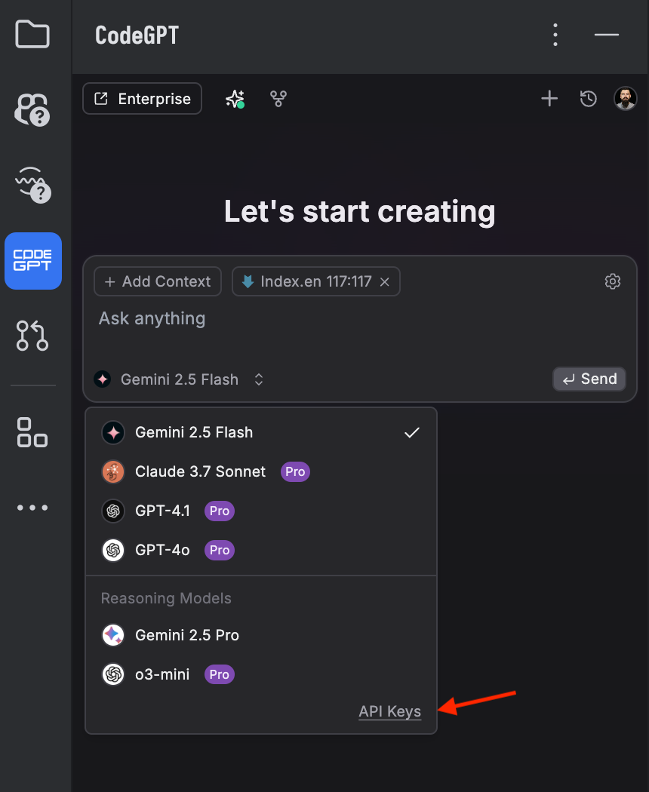
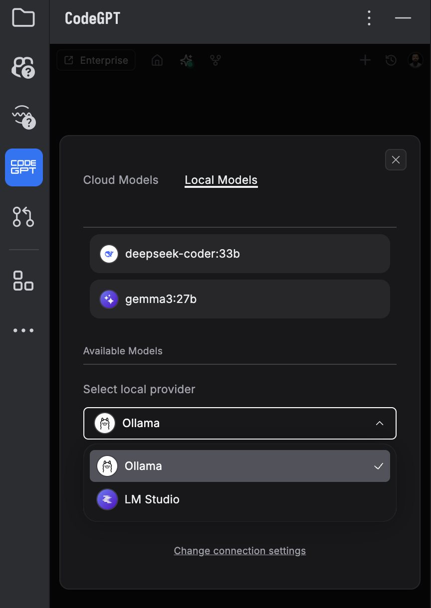
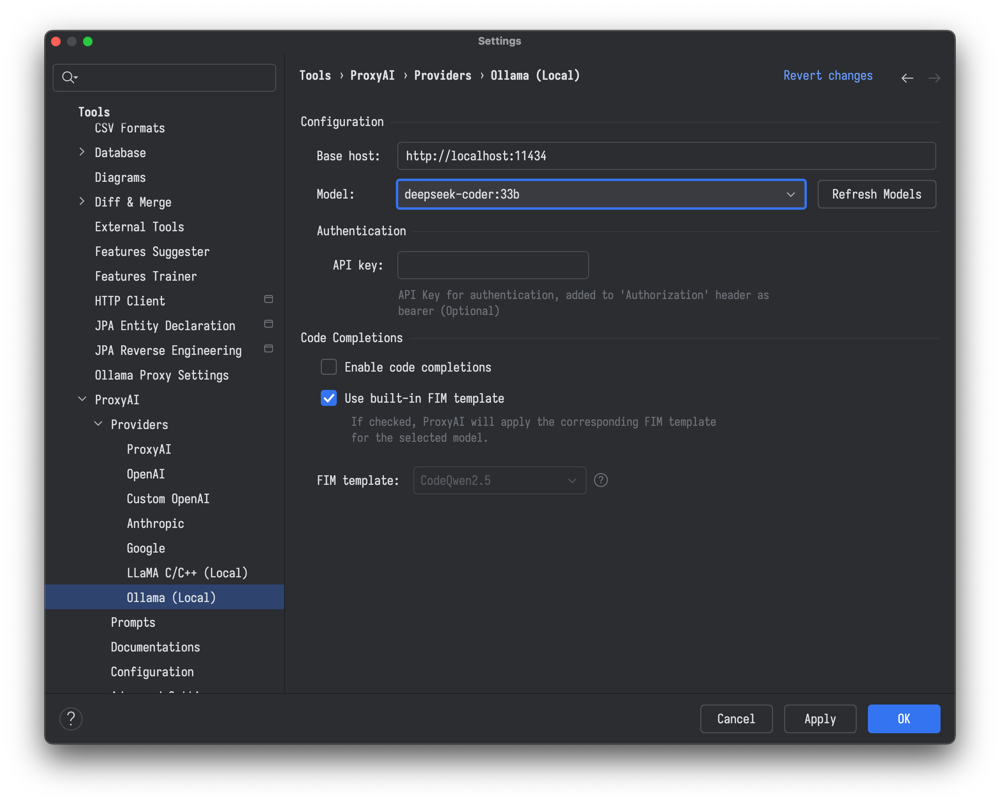
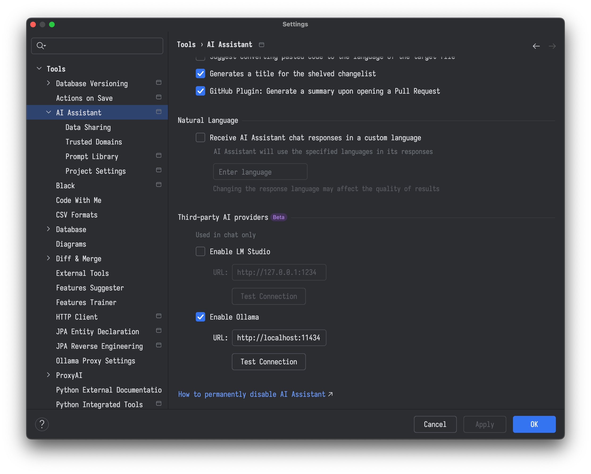
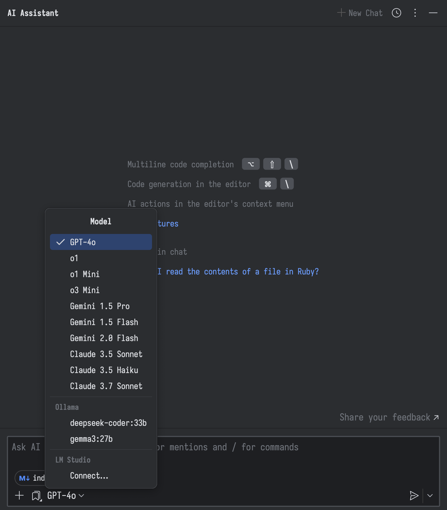

## Offline AI: The Power of Local LLMs for software engineers

AI coding assistants have revolutionized software development, offering unprecedented speed and efficiency. But this
power often comes at a price – both literally, with subscription fees, and figuratively, as your code is transmitted and
stored on remote servers. For developers concerned about data privacy and recurring costs, the solution may lie closer
to home: local large language models (LLMs). This article explores how offline AI, specifically local LLMs, can empower
software engineers with powerful coding assistance without compromising security or breaking the bank.

### Running LLM locally

Getting started with local LLMs is more accessible than you might think. You don't need a dedicated server farm. A
reasonably modern developer machine is often all it takes.

The most important component is your Graphics Processing Unit (GPU) specifically, its Video RAM (VRAM). The amount of
VRAM you have directly determines the size of the model you can run efficiently.

- **Entry-Level (12GB VRAM)**: An NVIDIA RTX 3060 or a modern MacBook Pro with 16GB of unified memory can comfortably
  run
  powerful 7-8 billion parameter models, which are perfect for most coding tasks.

- **Mid-Range (16GB+ VRAM)**: An NVIDIA RTX 4070/4080 or a MacBook Pro with an M-series Max/Ultra chip (32GB+ unified
  memory)
  allows you to run larger models (14B-32B), enabling more complex reasoning.

- **High-End (24GB+ VRAM)**: An NVIDIA RTX 3090/4090 gives you the power to run even larger models or fine-tune smaller
  ones
  with ease.

### Choosing Your Co-Pilot: Models Built for Code

Instead of a single, massive "do-everything" model, the local approach allows you to use a toolkit of smaller,
specialized models. For developers, models fine-tuned for coding are the way to go. Here are some of the top contenders:

#### For High-End Hardware

- **CodeLlama-34B**: Meta's largest code-specialized model offers excellent performance across multiple programming
  languages with strong reasoning capabilities.

- **DeepSeek Coder-33B**: Consistently ranks at the top of coding benchmarks with exceptional code completion and
  generation abilities.

- **Phind CodeLlama-34B-v2**: Fine-tuned specifically for software development with impressive performance on HumanEval
  and other coding benchmarks.

#### For Mid-Range Hardware

- **WizardCoder-15B**: Instruction-tuned version of CodeLlama that performs remarkably well despite its smaller size.

- **DeepSeek Coder-7B/16B**: Excellent balance of performance and resource requirements.

- **CodeLlama-13B**: Good all-around performer that runs on modest hardware.

Claude and Gemini: While excellent generalists, these are also powerful coders.

### The Software: Your AI Command Center

A fantastic ecosystem of open-source software makes running these models incredibly simple.

- **Ollama**: This is the easiest way to get started. Ollama is a command-line tool that lets you download, manage, and
  run LLMs with a single command. It automatically detects your hardware and handles the complexities for you.

- **LM Studio**: If you prefer a graphical interface, LM Studio provides a beautiful desktop application for
  discovering, downloading, and chatting with models. It also has great built-in support for chatting with your local
  documents (RAG).

### Get Started in 5 Minutes with Ollama

Here’s how fast you can be up and running.

1. Install Ollama: Download it from [ollama.com]().

2. Pull a Coding Model: Open your terminal and run:

```
ollama pull deepseek-coder:33b
````

3. Start using: Once it's downloaded, run:

```
olama run deepseek-coder:33b
```

4. Give It a Task: At the prompt, ask it to code something for you:

```
write a python function that takes a URL and returns the top 5 most common words from the webpage's body text.
```

You are now running a powerful AI coding assistant entirely on your own machine.

### Bringing Your AI into the IDE

While command-line tools and dedicated chat apps are powerful, the true magic happens when your local LLM integrates
directly into your Integrated Development Environment (IDE). This creates a seamless, context-aware coding experience
that keeps you in the flow, offering features like code completion, in-line chat, and refactoring, all powered by the
LLM running securely on your own machine.

The key to this integration is the OpenAI-compatible API server provided by tools like Ollama and LM Studio. Many
popular IDE extensions for AI assistance were originally built to communicate with cloud-based services like OpenAI. By
simply reconfiguring these extensions to point to your local server address (e.g., http://localhost:11434 for Ollama),
you can redirect their power to use your own private, local model.

As someone with extensive experience using JetBrains' development environments, I'll primarily discuss JetBrains IDE
plugins. It's worth noting that comparable plugin functionality exists for many other integrated development
environments as well.

- **CodeGPT**: This plugin provides AI-powered code suggestions and a chat interface within your JetBrains IDE. It can
  connect to local LLMs.
    - Install CodeGPT plugin from the JetBrains Marketplace
    - Ensure Ollama is running with your desired model (e.g., `ollama run your-model`)
    - Configure CodeGPT in JetBrains:
        - Click *API Keys*

{{< style "img { float: center; margin: 0.5em; width: 50%; }" >}}
  


   - Select your local model provider and a model and start using it

{{< style "img { float: center; margin: 0.5em; width: 50%; }" >}} 
  

      
- **ProxyAI**: An open-source plugin designed to connect JetBrains IDEs with locally running LLMs, including those
  managed
  by Ollama.
    - Install ProxyAI from the JetBrains Marketplace
    - Ensure Ollama is running with your desired model (e.g., `ollama run your-model`)
    - In your JetBrains IDE, go to _File > Settings/Preferences > Tools > ProxyAI > Providers > Ollama (Local)_
      
  
    
    - Click "Refresh Models" to sync with your running Ollama instance.
    - Optionally, choose an appropriate Fill-In-the-Middle (FIM) template if your model supports it for better code
      completions.
    - Click "Apply" or "OK".

- **JetBrains AI Assistant**: The official plugin from JetBrains now supports connecting to local models via Ollama or
  LM Studio, allowing for offline work.
    - Ensure Ollama or LM Studio is running with your desired model.
    - In your JetBrains IDE, click the JetBrains AI widget (often in the toolbar) or go to _Settings/Preferences >
      Tools > AI Assistant_
  
      
  
    - In the "Third-party AI providers" section, select your LLM provider (Ollama or LM Studio)
    - Specify your local host URL (e.g., http://localhost:11434 for Ollama, or the specific URL and port for LM Studio)
      and click "Test Connection"
    - Once connected, select the desired model


{{< style "img { float: right; margin: 0.5em; width: 50%; }" >}}
  

  


This direct IDE integration means you get AI assistance deeply embedded in your coding workflow, enhancing productivity
while maintaining complete data privacy.

### The Future of Development is Local

Local LLMs represent a fundamental shift, handing the keys to powerful AI back to the developer. The open-source
community is moving at a breakneck pace, with new models, improved quantization techniques, and more powerful tools
being released constantly. By embracing local LLMs, you're not just adopting a new tool; you're investing in a more
private, powerful, and personalized future for software development.