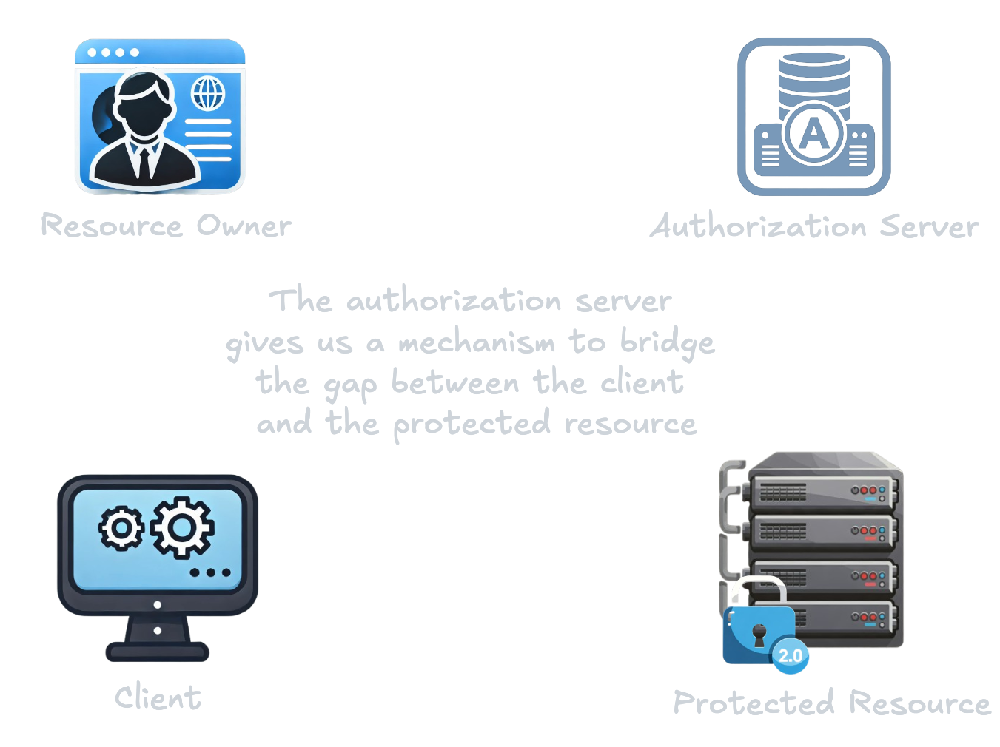

## What is OAuth 2.0?

Imagine having a cloud-based IoT service with your IoT devices connected to it, along with a smart home management service. You wish to control your devices via voice commands using the smart home management service. Fortunately, your smart home management service can interact with your IoT
service via an API. However, these services are managed by different companies, meaning your IoT service account
isn't connected to your smart home management service account. OAuth can resolve this by allowing you to delegate access to your
IoT devices across these services without revealing your password to the smart home service.

### Goal

OAuth 2.0 is an authorization framework enabling users to grant third-party access to their online resources without
revealing their credentials, such as usernames and passwords. This framework is widely adopted by major companies like
Facebook, Google, and Microsoft. It allows access to APIs, mobile applications, and websites without disclosing the
user's password to the third party, ensuring the security of user information.

OAuth 2.0 is an open standard for authorization that allows applications to access resources on a user's behalf. As an
evolution of the original OAuth protocol, OAuth 2.0 is designed to be simpler to implement and to offer enhanced
security. The primary objective of OAuth 2.0 is to enable users to share their data stored in one application with
another application without sharing their credentials. Instead, applications can receive an access token, which
authorizes access to specific resources for a limited time period.

By replacing the password-sharing antipattern, OAuth 2.0 introduces a delegation protocol that is both more secure and
more user-friendly.

OAuth is a protocol that allows end users to delegate a portion of their access authority for a protected resource to a client application to act on their behalf. To facilitate this process, OAuth introduces an additional component: the authorization server.

###  OAuth Flow

The authorization server (AS) is trusted by the protected resource to issue special-purpose security credentials, known as OAuth access tokens, to clients. To obtain a token, the client initially redirects the resource owner to the authorization server to request authorization. The resource owner then authenticates with the authorization server and is typically given the choice to authorize or deny the client's request. The client may request specific subsets of functionality, called scopes, which the resource owner can further restrict. After authorization is granted, the client can request an access token from the authorization server. This access token can be used to access the API at the protected resource as permitted by the resource owner.

**Access tokens:**
These tokens are used to authenticate API requests. They represent the permissions granted by the user and have a limited lifespan.

**Refresh tokens:**
These tokens are used to obtain a new access token when the current one expires. They have a longer lifespan and can be used multiple times, depending on the implementation.


sequenceDiagram
participant Resource Owner
participant Client
participant Authorization Server
participant Protected Resource
Client->>Resource Owner: Client requests authorization
Resource Owner-->>Authorization Server: 
Resource Owner->>Authorization Server: Resource Owner grants authorization
Authorization Server-->>Client: 
Client->>Authorization Server: Client sends authorization grant
Authorization Server->>Client: Authorization Server sends access token
Client->>Protected Resource: Client sends access token
Protected Resource->>Client: Protected Resource sends resource


## OAuth 2.0 authorization grant

Let's examine the OAuth authorization grant process in detail. We will explore each step involving the various actors,
tracing the HTTP requests and responses at each stage.

### Authorization grant types

- The canonical authorization code grant type
- Implicit grant type
- Client credentials grant type
- Resource owner credentials grant type
- Assertion grant types

## OAuth 2.0 authorization code grant in detail

The authorization code grant employs a temporary credential known as the authorization code. This code represents the
resource owner's delegation to the client. As illustrated in diagram below, we can decompose this process into several
discrete steps.

Initially, the resource owner visits the client application and expresses their desire for the client to access a
certain protected resource on their behalf. For example, this is the point where the user instructs the smart home management service
to utilize a specific IoT service. This service is an API that the client can handle, and the client is aware
that it must use OAuth to facilitate this process.

Subsequently, the authorization server typically prompts the user to authenticate. This crucial step identifies the
resource owner and delineates the permissions they can delegate to the client.

Next, the user grants authorization to the client application. During this stage, the resource owner opts to delegate a
portion of their access rights to the client application, and the authorization server provides various methods to
facilitate this. The client's request may specify the type of access it seeks, commonly referred to as the OAuth scope.

With the authorization code obtained, the client can now submit it to the token endpoint of the authorization server.

Upon receiving a valid request, the authorization server responds by issuing a token.

With the token acquired, the client can present it to the protected resource.

## OAuth’s actors

- Clients
- Authorization servers
- Resource owners
- Protected resources

Each actor in the OAuth protocol plays a unique role, collaborating smoothly to ensure the protocol functions correctly.

**OAuth client**: The OAuth client is a piece of software that requests access to protected resources on behalf of the
resource owner, utilizing OAuth to obtain the necessary permissions. Generally, the client is the simplest component in
the OAuth system, focusing primarily on acquiring and using tokens provided by the authorization server without needing
to understand or inspect the token's contents. The client handles the token as an opaque string. OAuth clients can
include web applications, native applications, or in-browser JavaScript applications. For instance, in our
IoT devices management example, the smart home management service acts as the OAuth client.

**Protected resource**: Accessible through an HTTP server, the protected resource requires an OAuth token for access.
This resource is responsible for validating the presented tokens and deciding the scope of access based on the token's
legitimacy. Ultimately, the protected resource has the final say on whether to honor a token. In the IoT devices management
example, the cloud-based IoT service is the protected resource.

**Resource owner**: The resource owner holds the authority to delegate access to the client. Unlike other OAuth
components, the resource owner is typically a person and not software. Usually, the resource owner interacts with the
authorization server via a web browser, known as the user agent. They might also interact with the client using a
browser, depending on the client's nature. In the IoT devices management example, the resource owner is the end user seeking to
control their devices.

**Authorization server**: This HTTP server is the central entity in the OAuth system, responsible for authenticating
both the resource owner and the client. It facilitates the authorization process and issues tokens to the client.
Besides its primary functions, some authorization servers offer additional capabilities like token introspection and
storing authorization decisions. In the IoT devices management scenario, the authorization server is managed by the
cloud-based IoT service for its protected resources.

## OAuth’s components

- Tokens
- Scopes
- Authorization grants

An OAuth access token, often simply referred to as a token, is a piece of data issued by the authorization server to a
client, signifying the rights assigned to the client. OAuth itself does not specify the format or content of the token,
but it always represents the client's requested access, the resource owner who authorized the client, and the
permissions granted during that authorization (usually including some indication of the protected resource).

To the client, OAuth tokens are opaque, meaning the client does not need to (and often cannot) inspect the token. The
client's responsibility is to obtain the token from the authorization server and present it to the protected resource.
However, the token is not opaque to everyone: the authorization server must be able to issue the token, and the
protected resource must be able to validate it. Therefore, both the authorization server and the protected resource need
to understand the token and its significance. This approach simplifies the client while providing the authorization
server and protected resource with significant flexibility in how tokens are utilized.

An OAuth scope represents a set of permissions at a protected resource. Scopes are represented by strings in the OAuth
protocol and can be combined into a set using a space-separated list, meaning the scope value cannot contain the space
character. The format and structure of the scope value are otherwise undefined by OAuth.

Scopes are crucial for limiting the access granted to a client. They are defined by the protected resource based on the
API it offers. Clients can request specific scopes, and the authorization server allows the resource owner to grant or
deny particular scopes to a client during its request. Scopes are generally additive in nature.

Consider a IoT devices management example: a cloud-based IoT service’s API defines several scopes for accessing IoT devices, such as
read-device-state, read-device-metadata, send-commands, receive-events, add-devices, and delete-devices. The smart home management service only needs the
read-device-state, send-commands, receive-events scope to perform its function. Once it has an access token with this scope, it can control IoT devices. If
the user wants the smart home management service to delete existing devices, the smart home management service needs the
delete-devices scope as well. The smart home management service asks the user to authorize this additional scope using the OAuth
process. Once the smart home management service has an access token with both scopes, it can perform actions requiring either or both
scopes using the same token.

An authorization grant is the method by which an OAuth client gains access to a protected resource via the OAuth
protocol, ultimately resulting in the client obtaining a token. This term can be confusing because it refers to both the
process by which the user delegates authority and the act of delegation itself. This confusion is compounded by the
authorization code grant type, as developers might assume that the authorization code alone constitutes the
authorization grant. However, it is the entire OAuth process that forms the authorization grant: the client directs the
user to the authorization endpoint, receives the code, and then exchanges the code for the token.

### Refresh tokens

An OAuth refresh token operates similarly to an access token in that it is granted to the client by the authorization
server, and the client treats its contents as a black box. The key distinction, however, is that this token is never
transmitted to the protected resource. Instead, the client utilizes the refresh token to obtain new access tokens
directly from the authorization server without needing to involve the resource owner.


sequenceDiagram
participant Client
participant Protected Resource
participant Authorization Server
Client->>Protected Resource: Request resource with access token
Protected Resource->>Client: Error response
Client->>Authorization Server: Refresh access token
Authorization Server->>Client: Return new access token and refresh token to client
Client->>Protected Resource: Request resource with access token
Protected Resource->>Client: Response with resource


## Interactions between OAuth’s actors and components

### Back-channel communication

Within the OAuth process, various components communicate using standard HTTP request and response formats. Since these
interactions typically occur outside the scope of the resource owner and user agent, they are collectively known as
back-channel communication. These communications utilize all the standard HTTP elements: headers,
query parameters, methods, and entity bodies, each potentially holding critical information for the transaction.

Unlike simpler web APIs, which may allow client developers to focus mainly on the response body, back-channel
communications often involve more in-depth use of the HTTP stack. The client requests access and refresh tokens from the
authorization server by calling its token endpoint directly, sending a form-encoded set of parameters. In reply, the
authorization server returns a JSON object representing the token.

In addition, when the client accesses the protected resource, it also performs an HTTP call within the back channel. The
specifics of this call vary depending on the protected resource, as OAuth can be employed to secure a vast range of APIs
and architectural styles. In every case, the client presents the OAuth token, which the protected resource must be able
to interpret and validate the rights associated with it.

### Front-channel communication

In typical HTTP communication, the HTTP client sends a request that includes headers, query parameters, entity body, and
other information directly to a server. The server analyzes this information to formulate an appropriate response, which
is sent back as an HTTP response containing headers, an entity body, and additional data. However, in OAuth, there are
scenarios where two components cannot directly exchange requests and responses, such as when the client interacts with
the authorization server's authorization endpoint.

Front-channel communication is a method that uses HTTP requests to facilitate indirect communication between two systems
via an intermediary web browser. This method maintains isolated sessions on either side of the
browser, allowing communication across different security domains. For example, if a user needs to authenticate with one
of the components, their credentials can remain protected from the other system. This approach ensures that information
remains segregated while still enabling communication in the user's presence.

Front-channel communication works by appending parameters to a URL and instructing the browser to navigate to that URL.
The receiving system can then parse the URL provided by the browser and process the received information. The response
from the receiving party involves redirecting the browser back to a URL controlled by the originator, using a similar
method of attaching parameters. Thus, both parties communicate indirectly by using the web browser as an intermediary,
resulting in paired HTTP request and response transactions for each front-channel exchange.

For instance, in the authorization code grant scenario mentioned earlier, the client must direct the user to the
authorization endpoint and communicate specific parts of its request to the authorization server. The client achieves
this by sending an HTTP redirect to the browser.


sequenceDiagram
participant Client
participant Resource Owner
participant Authorization Server
Note over Client,Authorization Server: Front-Channel Request
Client-->>Resource Owner: HTTP Redirect
Resource Owner->>Authorization Server: HTTP Request
Authorization Server->>Resource Owner: HTTP Response
Note over Client,Authorization Server: Front-Channel Response
Authorization Server-->>Resource Owner: HTTP Redirect
Resource Owner->>Client: HTTP Request
Client->>Resource Owner: HTTP Response


OAuth revolves around obtaining and utilizing tokens.
- Various parts of the OAuth framework focus on distinct segments of the process.
- Components communicate through direct (back-channel) and indirect (front-channel) HTTP methods.

## Implicit grant type

One key aspect of the various steps in the authorization code flow is that it keeps data isolated among different
components. This ensures that the browser remains unaware of details meant solely for the client and vice versa.
However, this separation becomes moot when the client operates within the browser.

In a JavaScript application running entirely inside the browser, the client cannot maintain secrets from the browser,
which has complete visibility into the client's execution. Thus, there’s no considerable advantage in sending the
authorization code through the browser to the client just to have it exchanged for a token. The additional secrecy layer
offers no added protection.

The implicit grant type simplifies this by directly returning the token from the authorization endpoint, eliminating the
extra secret and round trip. This grant type relies solely on the front channel to communicate with the authorization
server. It is particularly useful for JavaScript applications embedded in websites that need authorized and potentially
restricted session sharing across security domains.

Despite its convenience, the implicit grant has significant limitations. Firstly, it is impossible for a client using
this flow to keep a client secret, as the secret would be exposed to the browser. Although this flow does not require
client authentication at the authorization endpoint, the absence of client authentication affects the grant type's
security profile and mandates cautious use. Additionally, the implicit flow cannot obtain a refresh token. In-browser
applications tend to be short-lived, corresponding to the duration of the browser session in which they are loaded,
making refresh tokens less valuable. Furthermore, the implicit grant assumes the resource owner is still present in the
browser and can reauthorize the client if needed. Authorization servers can implement Trust On First Use (TOFU)
principles, allowing for seamless reauthentication to enhance the user experience.

## Client credentials grant type

What happens if there is no clear resource owner, or if the resource owner is essentially synonymous with the client
software itself? This scenario is fairly common, particularly when back-end systems need to communicate with each other
directly, without acting on behalf of a specific user. In such cases, since there is no user to delegate authorization
to the client, can OAuth still be used? Yes, it can, by employing the client credentials grant type that was introduced
in OAuth 2.0 specifically for this purpose. Unlike the implicit flow, where the client operates within the browser and
uses the front channel, in this flow, the client itself acts as the resource owner, and the user agent is not involved.
Consequently, this flow relies solely on the back channel, with the client obtaining the access token from the token
endpoint on its own behalf.

## Resource owner credentials grant type

If the resource owner possesses a plain username and password at the authorization server, the client can prompt the
user for these credentials to obtain an access token. The resource owner credentials grant type, commonly referred to as
the password flow, facilitates this process. In this flow, the resource owner interacts directly with the client,
bypassing the authorization server. This grant type solely employs the token endpoint, making it part of the
back-channel communication.

Included within the core OAuth specification, this grant type is based on the "ask for the keys" antipattern and is
generally considered insecure.

## Assertion grant types

In the first officially published extension grant types by the OAuth working group, known as assertion grant types, the
client receives a structured and cryptographically protected item called an assertion. This assertion is then used to
request a token from the authorization server. Think of an assertion like a certified document such as a diploma or
license. The trustworthiness of the document's contents is dependent on the credibility of the certifying authority.

Currently, two standardized formats exist for assertions: Security Assertion Markup Language (SAML) and JSON Web Token (JWT). This grant type operates exclusively through the back channel, and similar to the client credentials flow, there
might not be an explicit resource owner involved. However, unlike the client credentials flow, the rights conferred by
the token are determined by the assertion rather than just the client itself. Since the assertion typically originates
from a third party outside the client, the client may not need to understand the assertion's specifics.

In back-channel flows, the client sends an HTTP POST request to the authorization server's token endpoint, authenticates
itself as usual, and includes the assertion as a parameter. The methods for obtaining this assertion can vary
significantly and are often considered out of scope for many related protocols. For instance, the client might receive
the assertion from a user, a configuration system, or another non-OAuth protocol. Ultimately, what matters is that the
client can present the assertion to the authorization server. In this scenario, the client is presenting a JWT
assertion, as indicated by the `grant_type` parameter.

## Choosing the appropriate grant type

Given the variety of grant types available, selecting the most suitable one for your specific needs might seem
challenging. Fortunately, there are some reliable guidelines to help you make an informed decision.

## Summary

- The traditional authorization code grant type can be tailored for various deployment scenarios.
- Implicit grants are suitable for in-browser applications that do not require a distinct client.
- Client credentials grants and assertion grants are ideal for server-side applications where there is no explicit
  resource owner.
- The resource owner credentials grant should be avoided unless absolutely necessary.
