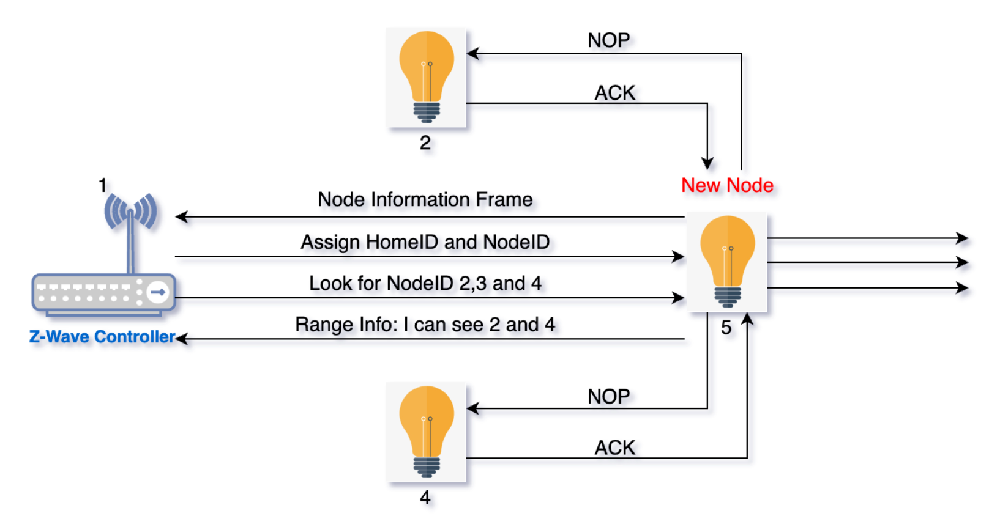
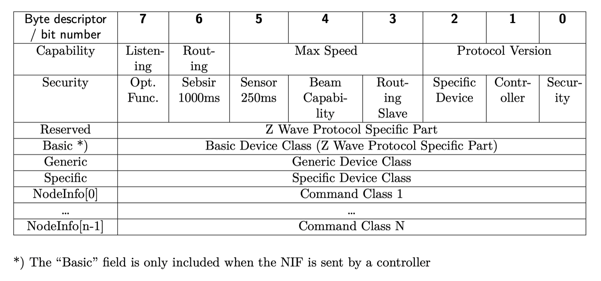
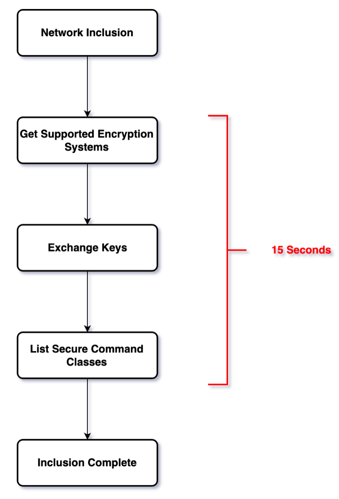
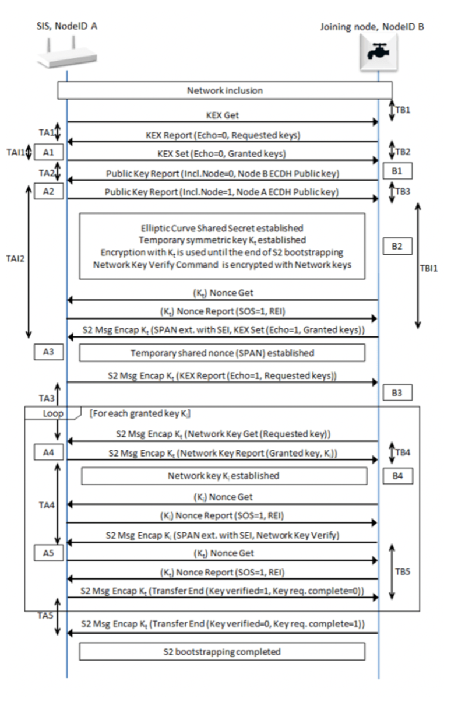
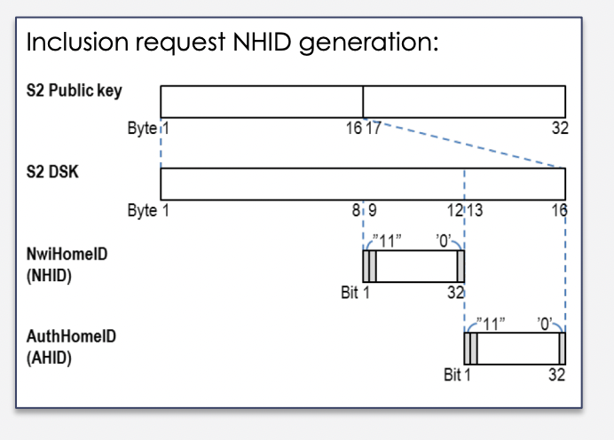
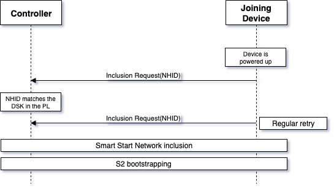

Z-Wave is a wireless communication protocol designed for home automation systems. It is a low-power, low-bandwidth network that allows devices in a home to communicate with each other and with a central controller, such as a hub or gateway. The protocol operates in the sub-1GHz frequency range and uses a mesh networking topology to ensure reliable and efficient communication between devices.

Z-Wave was first introduced in 2001 by a Danish company called Zensys and has since become a widely adopted standard for smart home automation. One of the key features of Z-Wave is its interoperability, which allows devices from different manufacturers to work together seamlessly. This is achieved through a certification program that ensures compatibility between devices.

Z-Wave supports a wide range of home automation devices, including lighting, climate control, security systems, and entertainment systems. Devices can be controlled through a variety of interfaces, including mobile apps, voice assistants, and physical switches.

Overall, Z-Wave offers a reliable and flexible solution for home automation, with a large ecosystem of compatible devices and a focus on interoperability.

Z-Wave operates on a mesh network topology, meaning that each device in the network can act as a repeater, helping to relay signals from other devices and extend the range of the network. This is accomplished through a process called routing, where devices in the network automatically determine the best path for transmitting data between themselves.

Z-Wave's devices use a routing table to determine the optimal path for data transmission based on factors such as signal strength, latency, and network congestion. The routing table is dynamically updated as devices join or leave the network or as the network topology changes. This ensures that data is always transmitted through the most efficient and reliable path, even as the network evolves over time.

## Z-Wave Routing

* Routing Table is build during inclusion
* Routing Table is updated on demand
* Source routing is 4 hops max
* Relies on single-cast with silent acknowledge

## Z-Wave device inclusion

The very first step of building Z-Wave network is to include devices to your controller.


In this example, we have an existing controller on the left - Node 1, and we have a few other nodes in the network.
Nodes 2, and 4 are visible. Once the new node enters learn mode, it will issue a node information frame - NIF and
a controller in Inclusion Mode will reply with an ```AssignNodeID``` frame, which carries the node new HomeId and NodeID.
After receiving the ```AssignNodeID``` frame the new node is part of the network.
Next, the controller will ask the node to discover its neighbours. In order to do neighbour discovery, the node will
then send NOP - no aberration frame to each of the requested nodes. So in this case, it starts out by a noping node 2
and receiving an ACK. Next up is node 3, as there is no node 3 within the range, the newly included node attempts this
unsuccessfully then carries on to node 4, which answers and finally returns to reply to the controller, which uses all
this information about which nodes are within the range to update the routing table.
To prevent adding unreliable links to the routing table, neighbour discovery is carried out at a reduced power.


## NIF

Node information frame is a business card of a Z-Wave node. NIF tells the capabilities of Z-Wave node from the lowest
protocol levels - from the MAC level up to Application layer. NIF tells what kind of device this is, so this would say
is this a smart bulb and if this is a smart bulb, which command classes are supported by this particular smart bulb.


## Security and Authentication


{{< style "img { display:block; margin: auto; width: 75%; margin-top: 2em;}" >}}


<--->

Z-Wave provides a security layer. Original “S0” security command class and newly defined “S2” security command class.


S2 provides 128 bit AES encryption. A “secure inclusion” is required to perform the key exchange. This must complete within 15 seconds of the network inclusion. “Secure inclusion” uses a “well known” key to transfer the network key and this is a minor weakness in the security which is fixed with DSK, see below. If the security key exchange fails, a device MUST be excluded from the network before it can be re-included.


Each application transaction requires two communications with the device: a NONCE (Number – used ONCE) which is only valid for 10 seconds; the encrypted command message (encrypted with the NONCE).



In S0 concept

* Uses a "standard" temporary Key to encrypt the Network Key, & send to the joining node
* This temporary Key can be easily known (or guess), and hence reduce the security robustness

In S2 concept

* Uses Elliptic Curve key exchange Protocol to establish a shared secret over an insecure channel

EC works on the principal of a Public and a Private Key pair

* All S2 devices have a set of Public and Private keys
* Public key is exchanged between 2 devices during inclusion
  * Public + Private keys = Temporary Key
* Temporary key → Encrypt the Network key
* Every inclusion → Different Temporary key

A major risk when including Z-Wave node and exchanging network keys is to include an unintended node and thus handing out the network keys to foreign and possibly malicious nodes. In oder to prevent this Z-Wave relies on authentication. Authentication works by stripping out part of the public key exchanged over the air and replacing it with zeros. The stripped out part is exchanged out of band either by entering it manually on the controller or by scanning QR code containing the stripped out part, also called DSK.


{{< style "img { display:block; margin: auto; width: 100%; margin-top: 2em;}" >}}


<--->

Step 1: Exchange PUBLIC KEY between Devices

* Both nodes create PUBLIC KEY using EC and send to each other
* The PUBLIC KEY can be entered manually to authenticate, or exchanged wirelessly
* Once the PUBLIC KEY is exchanged, the node can be created a SHARED KEY with their PRIVATE KEYS

Step 2: Generate the TEMPORARY KEY

* Exchange a shared Nonce (Number Used Once) between the nodes
* Using the new SHARED KEY, a TEMPORARY KEY will be created
* Using the new TEMPORARY KEY & Nonce, a SPAN( Singlecast Pre-Agreed Nonce) table will also be created
* Encrypt the PERMANENT KEY (using TEMPORARY KEY entry of SPAN table) and send to the Joining Node

Step 3: Verify the key using the PERMANENT KEY

* Exchange more keys if device support more than 1 Security level
  
  

## Z-Wave SmartStart

The purpose of the Z-Wave SmartStart is to allow Z-Wave nodes to be securely included into a network with a little to no interaction from an end user.  Z-Wave SmartStart allows for service provider to provision a device to a controller at the user’s site and ship the device to the user and once the device is powered up it will be automatically, securely included into a network.

### Why Z-Wave SmartStart

* Lower installation cost
  * Reduce installation time. Configuration of scenes, rules and scripts can be done at distribution center, or by installer ahead of time
* Reduce Support Costs
  * Reduce installation errors
  * Traceable with unique device specific keys enabling easy management of install base

* Products without button/interfaces Can now be installed without physical interaction - Sensors, Bulbs, Etc. Products in hard to reach places, e.g. roof windows
* Easy identification of installed devices

### How it works
SmartStart allows provisioning of the node before deployment.
The provisioning list - enabling the wireless setup to be prepared in the manufacturing/distribution phase Pre-configure adding devices to gateway provisioning list before end user/installer receives product.

New gateway - Provisioning list updated through backend when gateway is powered ON and online first time. Devices on gateway provisioning list gets included automatically, when powered ON.

SmartStart Gateway already installed - Easy add new devices by scanning QR code with smartphone - gets added to provisioning list through cloud/remote backend


{{< style "img { width: 100%; }" >}}


<--->
{{< style "img { width: 100%; }" >}}




SmartStart inclusion uses two inclusion requests. This allows battery devices to sleep while the gateway matches the request against the provisioning list.
